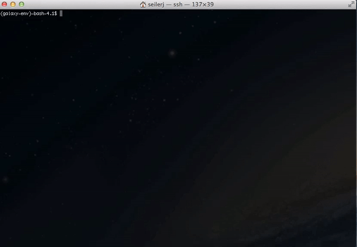
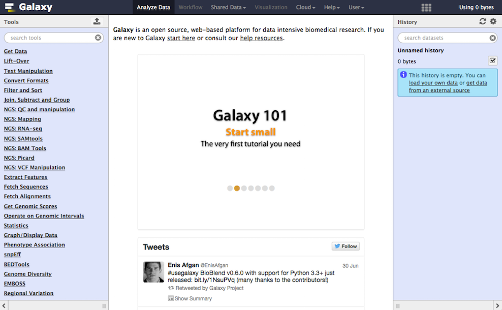

class: middle

# 

## The Grand-Est Galaxy instance

### www.galaxeast.fr

.footer[
Julien Seiler - IGBMC - 24/01/2017
]

---

layout: true
name: title
class: center, middle

.footer[

]

---

layout: true
name: content

.footer[
 - www.galaxeast.fr
]

---

template: title

# Please interrupt!

Your questions will be answered

---

template: title
background-image: url(./images/galaxy.jpg)

# What is Galaxy ?

---

class: center, middle

# Bioinformatics is complexe.

It involves : unix skills, data storage knowledge, compute cluster knowledge, reference data management...

---

class: center

# Running analyses **with tools**

---

class: center, middle

# 1 tool is **not enough** !

## Most bioinformatics analyses require to run many tools that must be **chained in a clever way**.

--

# Bioinformatics needs **a workflow tool**

---

class: center, middle

# What is **Galaxy** ?

## Galaxy is a **computing platform** that enables people to **run complex bioinformatics tools** on a **compute cluster** through a **simple web interface**.

 
.logo[] .logo[] .logo[] .logo[]

---

class: center

---

class: center

# Command line VS Galaxy

.video[]&nbsp;&nbsp;.video[]

---

class: center

# Galaxy **philosophy**

## **Perform**, and **share** complete analysis
## **No programming skills** required
## **Open source** and **free** solution
## **Very large** and **active** community
## Promote **reproducibility** and **usability**

---

template: title
background-image: url(./images/galaxy-bg.png)

.shadow[
# What is **Galaxeast** ?
]

---

template: content
class: center, middle

# Galaxeast is a **powerful** Galaxy instance for **integrative Omics data analysis**.

---

class: center

# About **Galaxeast**

## Hosted in **IGBMC datacenter** in Illkirch

--
## **Free** but for **academic purpose only**

--
## 488 CPU / 2.5Tb RAM / 50Tb storage (100Gb/user)

--
## **230 tools** including 172 dedicated to **NGS**

--
## Many workflows available from data quality control to de novo motif detection

--
## **396** registered users (+150 in 2016)

---

class: center

# **Using** Galaxeast

## Register by sending an email to **register@galaxeast.fr**
## Upload your data using your **webbrowser** (if < 2Gb) or through **FTP**
## Run **tools** or **workflows**
## Download or visualize your results

---

class: center

# The Galaxeast **workgroup**

## Provides **documentation** and **training** (visit wiki.galaxeast.fr)
## Integrates **new tools** or **genomes** (on demand)
## **Host** bioinformatics training
## Member of **the French Galaxy workgroup** since 2015

---

class: center, middle

